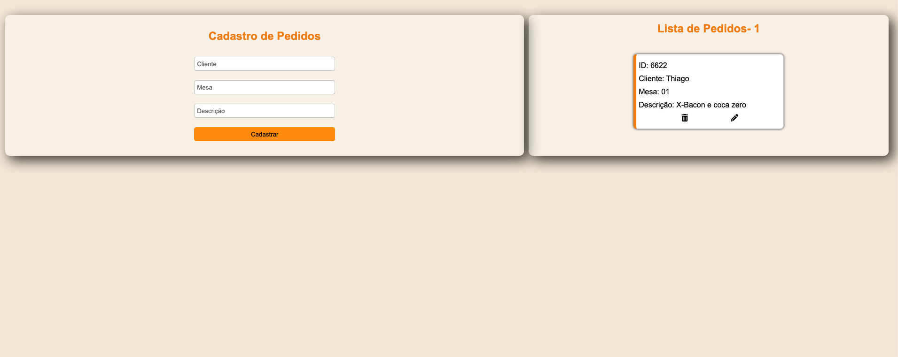

# Sistema de Pedidos

Este é um projeto de um sistema de pedidos simples, desenvolvido em JavaScript, HTML e CSS. O sistema permite que você adicione, edite e exclua pedidos, exibindo-os em uma lista na interface gráfica. Abaixo, você encontrará informações sobre como usar e entender o projeto.

## Funcionalidades

O sistema de pedidos possui as seguintes funcionalidades:

1. **Adicionar Pedido:** Preencha os campos de cliente, mesa e descrição e clique no botão "Cadastrar" para adicionar um novo pedido à lista.

2. **Editar Pedido:** Clique no ícone de lápis ao lado de um pedido para editar os detalhes desse pedido. Os campos serão preenchidos automaticamente com as informações do pedido selecionado. Após fazer as edições desejadas, clique no botão "Editar" para salvar as alterações.

3. **Excluir Pedido:** Clique no ícone de lixeira ao lado de um pedido para excluí-lo da lista.

4. **Mensagens de Feedback:** O sistema fornece mensagens de feedback em caso de sucesso ou erro ao adicionar, editar ou excluir um pedido.

5. **Contador de Pedidos:** O contador exibe a quantidade de pedidos na lista. Ele fica oculto quando não há pedidos na lista.

## Estrutura do Código

O código está estruturado em duas classes principais: `Pedido` e `ListaDePedidos`. Aqui está uma breve descrição de cada classe:

- **Pedido:** Esta classe representa um pedido individual e possui um construtor que aceita cliente, mesa e descrição como parâmetros. Ela também gera um ID aleatório para cada pedido.

- **ListaDePedidos:** Esta classe mantém uma lista de pedidos e oferece métodos para adicionar, editar, excluir e renderizar os pedidos na interface gráfica. Ela também fornece um contador de pedidos.

## Instruções de Uso

1. Abra o arquivo `index.html` no seu navegador.

2. Preencha os campos de cliente, mesa e descrição e clique em "Cadastrar" para adicionar um pedido à lista.

3. Para editar um pedido, clique no ícone de lápis ao lado do pedido desejado. Os campos serão preenchidos com os detalhes do pedido. Após fazer as edições, clique em "Editar" para salvar as alterações.

4. Para excluir um pedido, clique no ícone de lixeira ao lado do pedido.

## Autor

Este projeto foi desenvolvido por Thiago Ferreira.

## Contato

Se você tiver alguma dúvida ou sugestão, sinta-se à vontade para entrar em contato